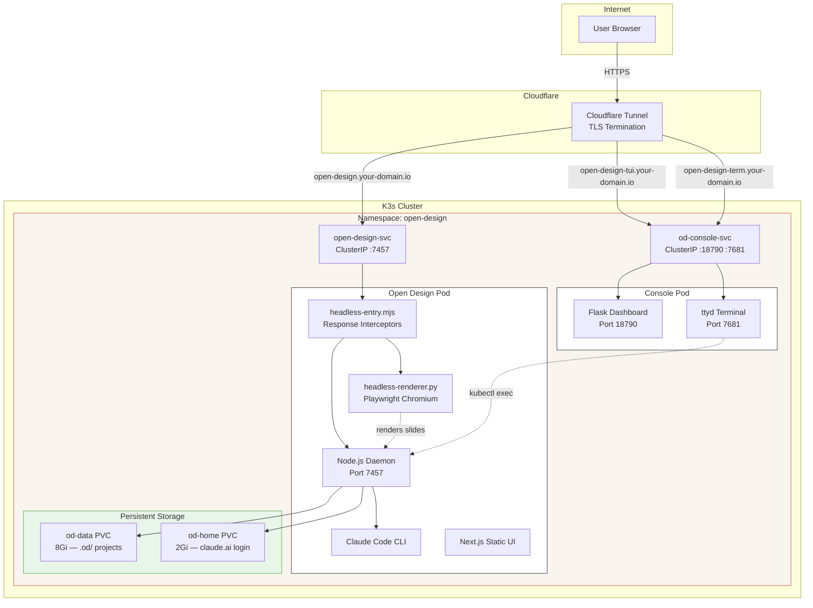
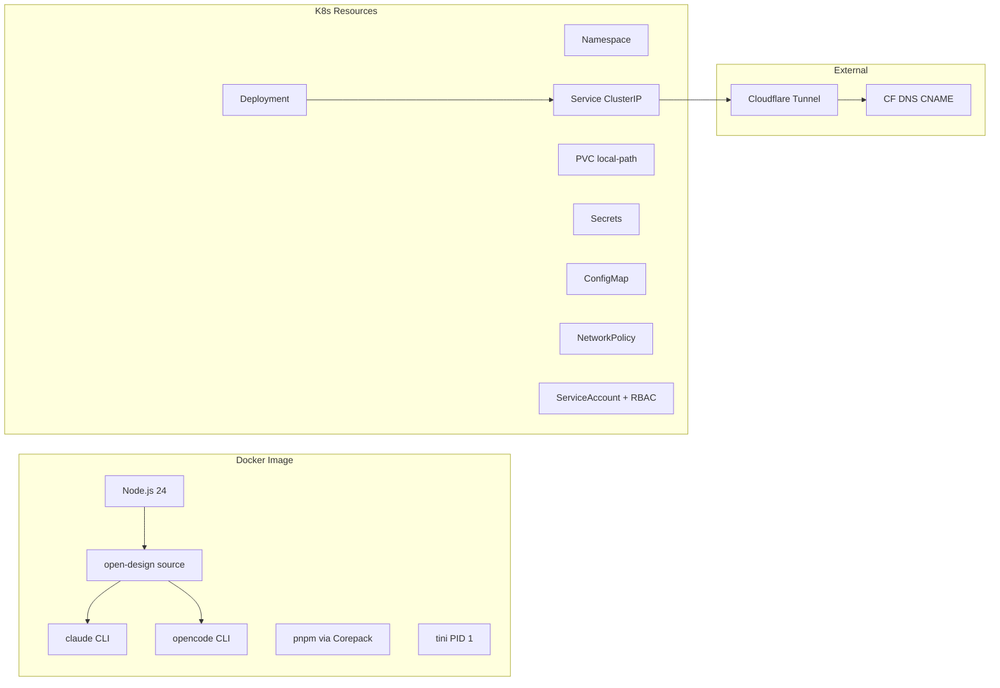

# Woow Open Design - K3s Deployment Package

> **Self-hosted AI Design Platform on Kubernetes** — Deploy [nexu-io/open-design](https://github.com/nexu-io/open-design) on K3s with Claude Code + OpenCode agent CLIs pre-installed, web console, and Cloudflare Tunnel exposure.


---

## Overview

This package provides a production-ready Kubernetes deployment of **Open Design** — the open-source Claude Design alternative. It containerizes the Node.js daemon with all required agent CLIs (Claude Code, OpenCode) pre-installed, adds a web-based terminal console for remote management, and exposes everything through Cloudflare Tunnel for secure public access.

| Challenge | Solution |
|-----------|----------|
| Open Design requires local Node.js + CLI setup | Fully containerized with all dependencies in a single Docker image |
| Agent CLIs need manual installation | Claude Code pre-installed and auto-detected by daemon |
| **PDF/PPTX/Image export returns 501** | **Headless Playwright renderer replaces Electron desktop renderer** |
| **Standalone HTML missing images** | **Response interceptor embeds images as base64 data URIs** |
| **Image export uses File System Access API** | **Monkey-patch redirects to server-side rendering** |
| No remote terminal access to the design pod | Web-based ttyd terminal console with Flask dashboard |
| Exposing to the internet safely | Cloudflare Tunnel integration with HTTPS and edge security |
| CLI auth state lost on pod restart | Persistent `/home` volume (PVC) preserves login sessions |

## Screenshots

### Home Page — Design Prompt Interface


### Agent Detection — Claude Code + OpenCode


### Design Project — Live Slide Preview


### Export Options — PDF, PPTX, Image, ZIP, HTML


### Web Terminal — Remote Pod Access via ttyd


### Console Dashboard — Agent Status API


## Architecture



### Component Overview



## Repository Structure

```
.
├── Dockerfile.open-design          # Multi-stage build: Node 24 + Playwright Chromium
├── headless-entry.mjs              # Node.js entry point with export interceptors
├── headless-renderer.py            # Python Playwright slide renderer
├── deploy.sh                       # One-click build → import → apply script
├── k8s-manifests/
│   ├── 00-namespace.yaml           # Namespace: open-design
│   ├── 01-secrets.yaml             # OD_API_TOKEN + ANTHROPIC_API_KEY
│   ├── 02-config.yaml              # OD_ALLOWED_ORIGINS, OD_PORT, OD_BIND_HOST
│   ├── 03-pvc.yaml                 # 8Gi data PVC + 2Gi home PVC
│   ├── 04-deployment.yaml          # Daemon deployment (4 CPU / 8Gi RAM)
│   ├── 05-service.yaml             # ClusterIP service on port 7457
│   ├── 06-networkpolicy.yaml       # Ingress rules for daemon + console
│   ├── 07-console-rbac.yaml        # ServiceAccount + Role + RoleBinding
│   ├── 08-console-deployment.yaml  # Console pod (Flask + ttyd) + Service
│   └── 09-console-configmaps.yaml  # Console app code as ConfigMaps
├── console/
│   ├── app.py                      # Flask dashboard with agent status API
│   ├── connect.sh                  # ttyd wrapper: kubectl exec into daemon pod
│   ├── entrypoint.py               # Process orchestrator (Flask + ttyd)
│   └── templates/
│       └── index.html              # Web dashboard UI
├── docs/
│   └── screenshots/                # UI screenshots for documentation
│       ├── od-home.png
│       ├── od-agent-select.png
│       ├── od-project-view.png
│       ├── od-download-menu.png
│       ├── od-tui-login.png
│       └── od-console-dashboard.png
├── .gitignore
├── README.md                       # This file (English)
└── README_zh-TW.md                 # Traditional Chinese README
```

## Prerequisites

| Requirement | Version | Notes |
|-------------|---------|-------|
| K3s | v1.34+ | Single-node or multi-node cluster |
| buildah | 1.33+ | Container image builder (replaces Docker) |
| podman | 4.9+ | Container runtime for verification |
| kubectl | v1.34+ | Kubernetes CLI |
| Cloudflare Account | — | For tunnel and DNS setup |

## Quick Start

### 1. Clone and Deploy

```bash
git clone https://github.com/WOOWTECH/Woow_opendesign_docker_compose_all.git
cd Woow_opendesign_docker_compose_all

# Build image, import to K3s, apply manifests
chmod +x deploy.sh
./deploy.sh
```

### 2. Import Image to K3s

```bash
# Build with buildah
buildah bud -t open-design:latest -f Dockerfile.open-design .

# Import to K3s containerd
podman save open-design:latest | sudo k3s ctr images import -

# Apply all manifests
kubectl apply -f k8s-manifests/
```

### 3. Configure Cloudflare Tunnel

Add these routes to your Cloudflare Tunnel configuration:

| Hostname | Service |
|----------|---------|
| `open-design.your-domain.io` | `http://open-design-svc.open-design.svc.cluster.local:7457` |
| `open-design-tui.your-domain.io` | `http://od-console-svc.open-design.svc.cluster.local:18790` |
| `open-design-term.your-domain.io` | `http://od-console-svc.open-design.svc.cluster.local:7681` |

Create DNS CNAME records pointing each subdomain to `<tunnel-id>.cfargotunnel.com`.

### 4. Authenticate Claude Code

```bash
# Access the web terminal
open https://open-design-term.your-domain.io
# Login: admin / <TUI_PASSWORD from od-secrets>

# Inside the terminal, authenticate Claude:
claude
# Follow the interactive login flow
```

The login state persists across pod restarts thanks to the `open-design-home-pvc`.

## Configuration

### Environment Variables (ConfigMap)

| Variable | Default | Description |
|----------|---------|-------------|
| `OD_PORT` | `7457` | Daemon listen port |
| `OD_BIND_HOST` | `0.0.0.0` | Bind address |
| `OD_ALLOWED_ORIGINS` | `https://open-design.your-domain.io` | CORS allowed origins |
| `OD_PUBLIC_BASE_URL` | `https://open-design.your-domain.io` | **Required for MCP OAuth.** Public HTTPS URL for OAuth callback registration. Without this, the daemon derives the URL from internal request headers (http:// behind proxy), causing `invalid_request` errors from OAuth providers. |
| `OD_DISABLE_API_AUTH` | `1` | Disable token auth (Cloudflare handles security) |

### Secrets

| Key | Description |
|-----|-------------|
| `OD_API_TOKEN` | Auto-generated by deploy.sh (used for internal API calls) |
| `TUI_PASSWORD` | Web terminal login password |
| `ANTHROPIC_API_KEY` | (Optional) Anthropic API key — or use `claude` login instead |

### Resource Limits

| Component | CPU Request | CPU Limit | Memory Request | Memory Limit |
|-----------|-------------|-----------|----------------|--------------|
| Daemon | 1000m | 4000m | 2Gi | 8Gi |
| MCP Server | 100m | 1000m | 512Mi | 3Gi |
| Console | 100m | 500m | 128Mi | 512Mi |

> **Note**: MCP Server memory increased from 512Mi to 3Gi. Supergateway + Uvicorn + Python SSE peaks at ~1.5Gi for large prompts. OOMKilled at lower limits.

## Export Formats

All export formats tested and verified on both deck (slides) and landing page projects:

| Format | Deck Project | HTML Project | How It Works |
|--------|-------------|-------------|--------------|
| Export as PDF | 6.5 MB, 5 pages | 916 KB | fetch monkey-patch redirects `/export/pdf` to `/export/pdf-image` for blob download |
| Export as PPTX (Screenshot) | 4.4 MB, 5 slides | N/A | Server-side Playwright renders each slide to PNG, assembled by pptxgenjs |
| Export as Image (PNG) | 59 KB - 1.5 MB per slide | 1.3 MB | MutationObserver hijacks Save button, calls `/export/image` API |
| Export as Image (JPEG) | 45 KB - 354 KB | 354 KB | Same as PNG, server returns JPEG |
| Export as Image (WebP) | 27 KB - 239 KB | 239 KB | Server returns PNG, client re-encodes via `canvas.toBlob('image/webp')` |
| Download as .zip | 4.2 MB | 17 KB | Native OD feature, always works |
| Export as standalone HTML | 11 MB (images embedded) | 50 KB | Response interceptor inlines `` as base64 |

### Export Architecture

The OD daemon has a **two-tier architecture** for exports:
- **Electron desktop mode**: Uses IPC to Chromium for rendering (not available on K3s)
- **Bare daemon mode (K3s)**: Without Electron, all rendering-dependent exports return 501

**Our fix** injects a headless Playwright renderer via `headless-entry.mjs`:

```
headless-entry.mjs
├── Creates headlessSlideRenderer(input)
│    └── execFileAsync(python3, headless-renderer.py, input)
│         └── Playwright Chromium renders slides to PNG/JPEG
│              └── Loads assets from http://localhost:7457/ (async, non-blocking)
├── Creates headlessPdfExporter(input)
│    └── execFileAsync(python3, pdf-script, input)
│         └── Playwright page.pdf() for vector PDF
├── Response Interceptors:
│    ├── PDF: fetch monkey-patch redirects /export/pdf → /export/pdf-image
│    ├── HTML: inlines  as base64 data URIs
│    └── Image: MutationObserver hijacks Save dialog → /export/image API
└── startServer({ desktopSlideRenderer, desktopPdfExporter })
     └── OD daemon with export routes ENABLED
```

## MCP Server Integration

Open Design supports connecting to external MCP (Model Context Protocol) servers for extending agent capabilities. The Integrations page (`/integrations`) allows adding MCP servers with two authentication modes:

### OAuth MCP Servers (e.g. Higgsfield)

For MCP servers that require OAuth authorization (like [Higgsfield/OpenClaw](https://higgsfield.ai/mcp)):

1. Go to **Integrations → External MCP Servers → Add Server**
2. Select a template (e.g. "Higgsfield (OpenClaw)") or enter a custom URL
3. Click **Connect** — OD opens the OAuth authorization page
4. After approval, the token is stored server-side and persists across sessions

**Critical**: `OD_PUBLIC_BASE_URL` must be set to your public HTTPS domain. Without it, the OAuth callback URL is registered as `http://` (from internal proxy headers) but the browser redirects via `https://`, causing `invalid_request` errors.

```
# OAuth flow:
Browser → OD daemon (POST /api/mcp/oauth/start)
  → Dynamic Client Registration (RFC 7591) with callback URL from OD_PUBLIC_BASE_URL
  → Authorization URL opened in browser
  → User approves
  → OAuth provider redirects to https://<domain>/api/mcp/oauth/callback
  → OD exchanges code for token (PKCE + state validation)
  → Token persisted in mcp-tokens.json
```

### Token-in-URL MCP Servers (e.g. Custom Odoo MCP)

For MCP servers that use a private token embedded in the URL:

```
https://your-mcp-server.example.com/private_<token>/mcp
```

Configure with:
- **Transport**: `http` (StreamableHTTP, not SSE)
- **Auth Mode**: `none` (token is in the URL itself)

Via API:
```bash
curl -X PUT http://localhost:7457/api/mcp/servers \
  -H 'Content-Type: application/json' \
  -d '{
    "servers": [{
      "id": "custom",
      "transport": "http",
      "enabled": true,
      "label": "My MCP Server",
      "url": "https://your-server.example.com/private_xxx/mcp",
      "authMode": "none"
    }]
  }'
```

### Troubleshooting MCP Connections

| Symptom | Cause | Fix |
|---------|-------|-----|
| `Auth provider returned error: invalid_request` | OAuth callback URL uses `http://` instead of `https://` | Set `OD_PUBLIC_BASE_URL=https://your-domain` in ConfigMap |
| `could not discover OAuth metadata` | Server doesn't support OAuth (uses token-in-URL) | Change `authMode` to `none` and `transport` to `http` |
| MCP server shows as connected but tools don't work | Wrong transport type (SSE vs StreamableHTTP) | Change `transport` from `sse` to `http` for StreamableHTTP servers |
| OAuth cached with wrong redirect URI | Stale DCR client registration | Delete `mcp-oauth-clients.json` and restart pod |

## Docker Image Details

The multi-stage Dockerfile (`Dockerfile.open-design`) builds:

**Stage 1 (builder):**
- Base: `node:24-slim`
- Clones [nexu-io/open-design](https://github.com/nexu-io/open-design) v0.15.1 from source
- Installs dependencies with `corepack pnpm`
- Builds web UI (static export) and daemon

**Stage 2 (runtime):**
- Base: `node:24-slim` (Debian for glibc compatibility)
- Installs `tini` as PID 1 for proper child process management
- Installs **Playwright Chromium** + Python venv for headless rendering
- Installs **Claude Code** via `npm install -g @anthropic-ai/claude-code`
- Copies `headless-entry.mjs` and `headless-renderer.py` for export support
- CMD: `node headless-entry.mjs` (wraps daemon with renderer injection)
- Final image size: ~6.9 GB (includes Chromium browser)

## Security

- **Cloudflare Tunnel** — All traffic encrypted with TLS at edge
- **NetworkPolicy** — Pod-to-pod isolation; only tunnel traffic can reach services
- **RBAC** — Console ServiceAccount scoped to specific pods and deployments
- **No root** — Daemon runs as `opendesign` user (UID 1001)
- **tini** — Proper PID 1 for zombie process reaping

## Troubleshooting

| Symptom | Cause | Fix |
|---------|-------|-----|
| Pod `ErrImageNeverPull` | Image not imported to the correct node | Add `nodeSelector` to pin pod to the node with the image |
| `API_TOKEN_REQUIRED` error | `OD_API_TOKEN` env blocks browser UI | Set `OD_DISABLE_API_AUTH=1` in ConfigMap |
| Claude auth fails: "Invalid API key" | `ANTHROPIC_API_KEY` placeholder overrides login | Remove `ANTHROPIC_API_KEY` from deployment env |
| ttyd returns 502 | NetworkPolicy blocks console ports | Add `od-console-policy` with ports 18790 + 7681 |
| Claude login lost after restart | `/home/opendesign` not persistent | Mount `open-design-home-pvc` at `/home/opendesign` |
| Export returns 501 | No headless renderer (using old od.mjs entry point) | Use `headless-entry.mjs` as CMD in Dockerfile |
| Export returns 502 (renderer crash) | `execFileSync` deadlock or paginate clip bug | Ensure using latest `headless-entry.mjs` with async execFile |
| MCP pod OOMKilled | Memory limit too low for large prompts | Increase MCP memory limit to 3Gi |
| Image export only exports slide 1 | Missing `deck:true` in request body | Ensure latest `headless-entry.mjs` with deck detection |
| Standalone HTML images broken | `inlineRelativeAssets()` doesn't handle `` | Response interceptor handles this automatically |
| Image export fails on mobile | File System Access API not available | Monkey-patch redirects to server-side `/export/image` API |

## URLs

| Service | URL | Description |
|---------|-----|-------------|
| Open Design UI | `https://open-design.your-domain.io` | Main design interface |
| Console Dashboard | `https://open-design-tui.your-domain.io` | Flask status dashboard |
| Web Terminal | `https://open-design-term.your-domain.io` | ttyd browser terminal |
| Health Check | `https://open-design.your-domain.io/api/health` | `{"ok":true,"version":"0.12.1"}` |
| Agents API | `https://open-design.your-domain.io/api/agents` | List detected agent CLIs |

## Changelog

### v2.1.0 — MCP OAuth & Integration Fix (2026-07-22)

**Problem**: External MCP servers (Higgsfield, custom Odoo MCP) failed to connect through Open Design's Integrations page.

**Root Causes**:
1. **OAuth `invalid_request`**: The daemon derived its callback URL from internal request headers (`http://` behind Cloudflare tunnel), but the browser redirects via `https://`. The OAuth provider's redirect_uri validation failed on scheme mismatch.
2. **Custom MCP misconfigured**: When adding a token-in-URL MCP server via the UI, OD defaults to `authMode: "oauth"` and `transport: "sse"`, but these servers need `authMode: "none"` and `transport: "http"` (StreamableHTTP).

**Fixes**:
- Added `OD_PUBLIC_BASE_URL` to ConfigMap — forces the daemon's `getPublicBaseUrl()` to return the correct HTTPS URL for OAuth Dynamic Client Registration (DCR)
- Documented how to configure both OAuth and token-in-URL MCP servers
- Added MCP troubleshooting table

**Configuration**:
```yaml
# k8s-manifests/02-config.yaml
data:
  OD_PUBLIC_BASE_URL: "https://open-design.your-domain.io"  # Required for MCP OAuth
```

### v2.0.0 — Headless Export Engine (2026-07-22)

**Problem**: On self-hosted K3s (without Electron), the OD daemon returned HTTP 501 for all rendering-dependent exports (PDF, PPTX, Image). Standalone HTML exported with broken images. The frontend's image export used the File System Access API which doesn't work on mobile or headless browsers.

**Root Cause**: OD daemon has a two-tier architecture:
- **Electron desktop**: Provides `desktopSlideRenderer` and `desktopPdfExporter` callbacks via IPC
- **Bare daemon (K3s)**: These callbacks are `null`, causing all export routes to return 501

**Solution**: Created a headless Playwright-based renderer that injects into `startServer()`:

#### New Files

| File | Purpose |
|------|---------|
| `headless-renderer.py` | Python Playwright script. Renders OD slides to PNG/JPEG screenshots. Supports deck mode (slide-by-slide via `<deck-stage>`), page mode (full-page), paginate mode (scroll-based chunking), and stitch mode (all slides as one tall image). |
| `headless-entry.mjs` | Node.js entry point. Wraps `startServer()` with headless renderer injection. Adds response interceptors for PDF binary download, HTML image inlining, and image export monkey-patch. Uses **async** `execFile` (critical: sync would deadlock since renderer loads assets from the daemon itself). |

#### Response Interceptors (injected via `<script data-od-headless-patch>`)

| Interceptor | What it does | Why it's needed |
|-------------|-------------|----------------|
| **PDF fetch monkey-patch** | Overrides `window.fetch()` to redirect `POST /export/pdf` to `/export/pdf-image`. Triggers blob download, returns `{ok:true}` to satisfy frontend's `dc()` function. | Frontend's PDF export expects Electron IPC (`t.json().catch(()=>({}))`), has no code path to trigger a file download from HTTP response. |
| **HTML image inliner** | Intercepts `GET /export/...?inline=1` responses. Post-processes HTML to replace `` with `data:image/...;base64,...` data URIs. | OD's `inlineRelativeAssets()` only handles `<link>` and `<script>` tags. Images are a known gap (nexu-io/open-design#368). |
| **Image export hijacker** | MutationObserver detects "Export as image" dialog. Hijacks Save button to call `/export/image` API with correct slide index and `deck:true`. WebP: requests PNG from server, re-encodes via `canvas.toBlob('image/webp')`. | Frontend captures canvas snapshots from iframes which fails on mobile/headless. Server-side rendering is more reliable. |

#### Bug Fixes

| Bug | Root Cause | Fix |
|-----|-----------|-----|
| `execFileSync` deadlock | Synchronous child process blocked event loop. Renderer loaded assets from `localhost:7457` (the daemon), which was blocked. | Changed to `execFileAsync = promisify(execFile)` |
| Paginate mode crash (`Clipped area outside image`) | `page.screenshot(clip={y: offset})` fails when offset > viewport height | Scroll to position first, then clip from viewport origin |
| Image export always renders slide 1 | Missing `deck:true` in API request body | Detect deck from `.speaker-notes-panel-meta` + `.deck-thumbnail-rail` |
| Slide index detection picks wrong element | `"6/6 checks passed"` matched the `N/M` regex | Only search deck-specific DOM elements |
| fileName detection fails for `"slides.html Close tab"` | Tab text included " Close tab" suffix | Clean text before matching `.html$` |
| PDF download shows blank pages | Browser print-to-PDF only captures viewport | Switched from 501 fallback to fetch monkey-patch with blob download |

#### Metrics

| Metric | Before | After |
|--------|--------|-------|
| API exports working | 2/7 (29%) | 7/7 (100%) |
| UI exports working (deck) | 2/8 (25%) | 8/8 (100%) |
| UI exports working (HTML) | 2/6 (33%) | 6/6 (100%) |
| OD version | v0.14.2 | v0.15.1 |
| MCP memory limit | 512Mi | 3Gi |

### v1.0.0 — Initial K3s Deployment Package

- Multi-stage Docker image with Node.js 24 + agent CLIs
- K8s manifests for namespace, secrets, config, PVC, deployment, service, network policy
- Web console with Flask dashboard + ttyd terminal
- Cloudflare Tunnel integration
- deploy.sh one-click deployment script

## Support

- **Issues:** [GitHub Issues](https://github.com/WOOWTECH/Woow_opendesign_docker_compose_all/issues)
- **Open Design Docs:** [nexu-io/open-design](https://github.com/nexu-io/open-design)
- **OpenCode:** [opencode.ai](https://opencode.ai)
- **Claude Code:** [Anthropic Docs](https://docs.anthropic.com/en/docs/claude-code)

---

*Built and deployed by WOOWTECH on K3s cluster infrastructure.*
