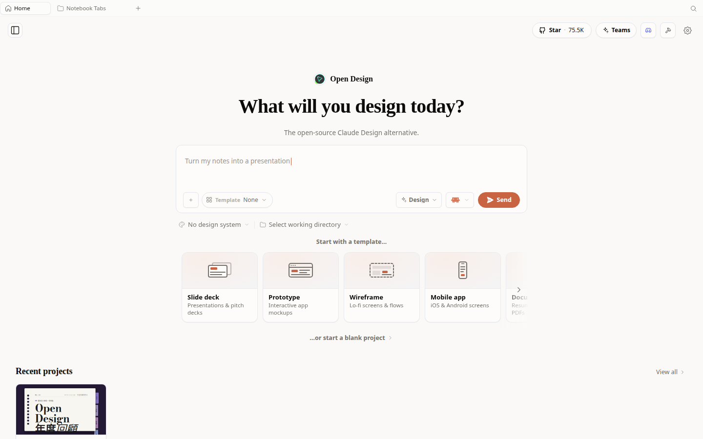
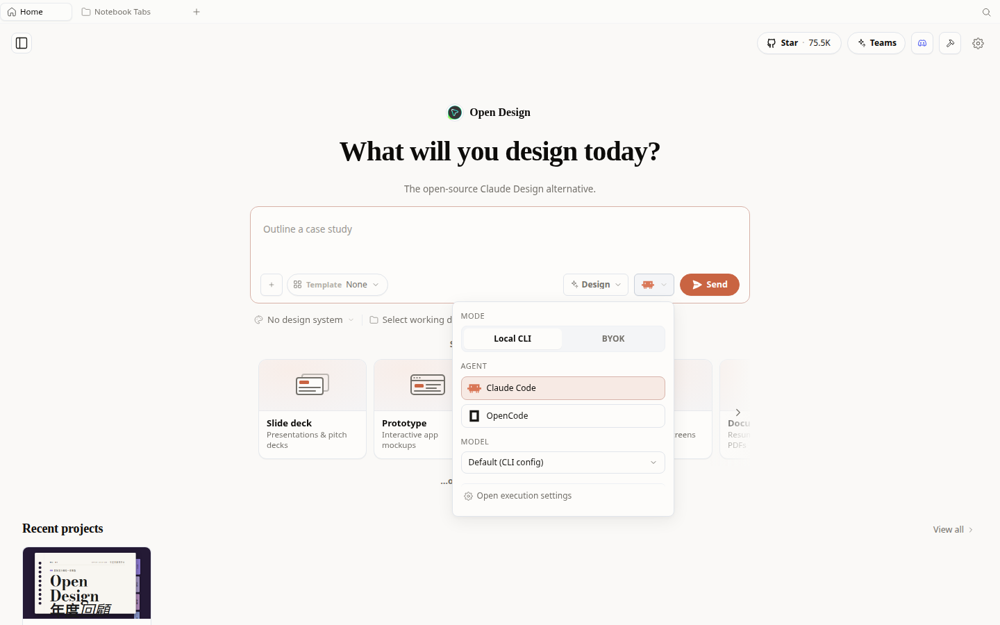
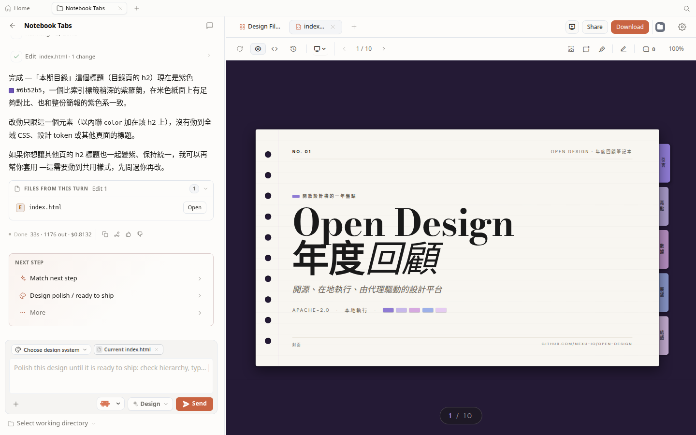
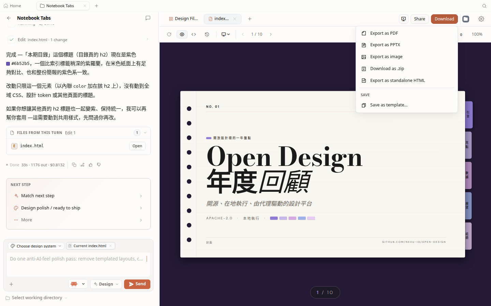
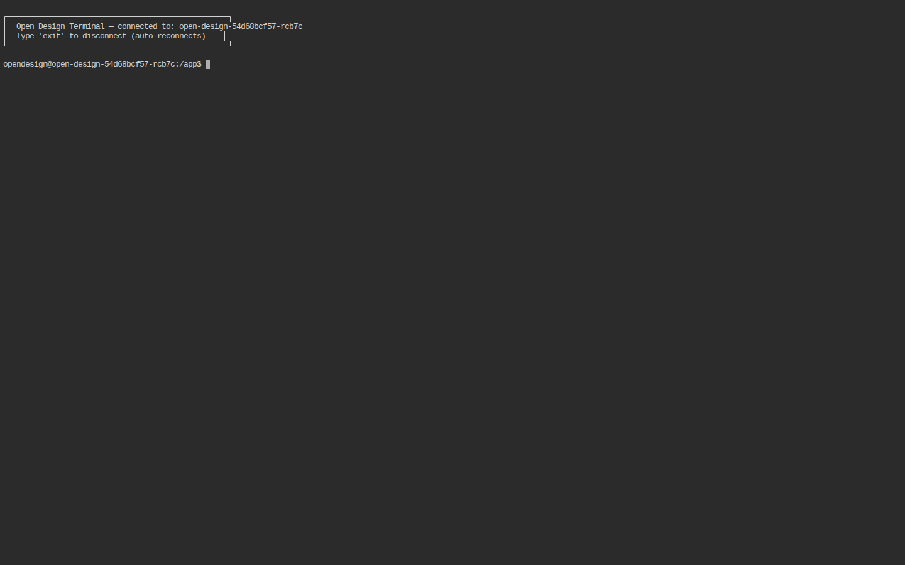
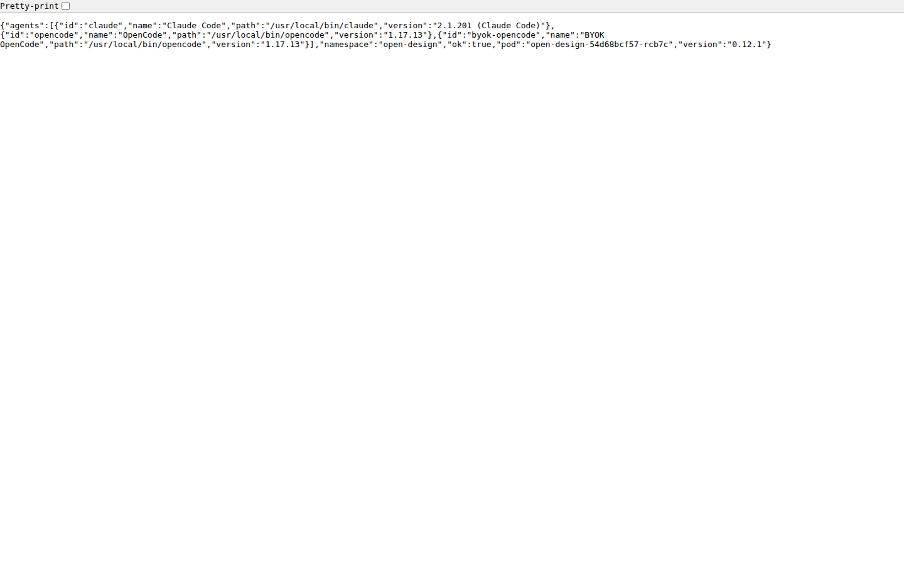
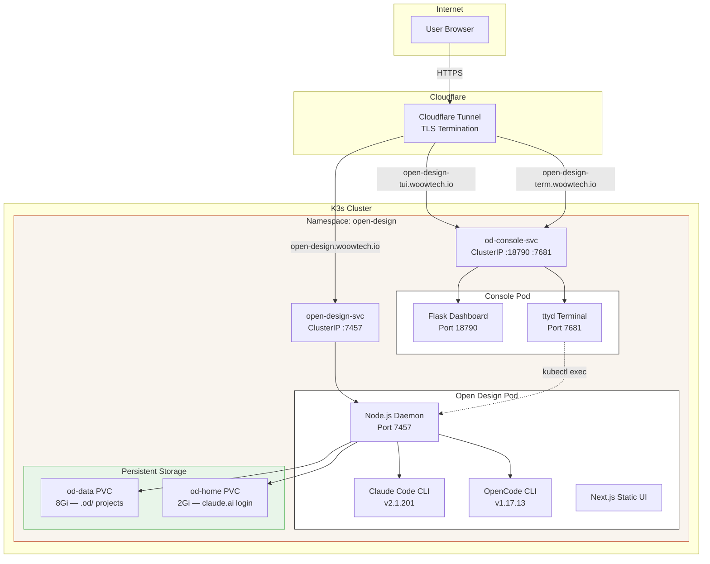
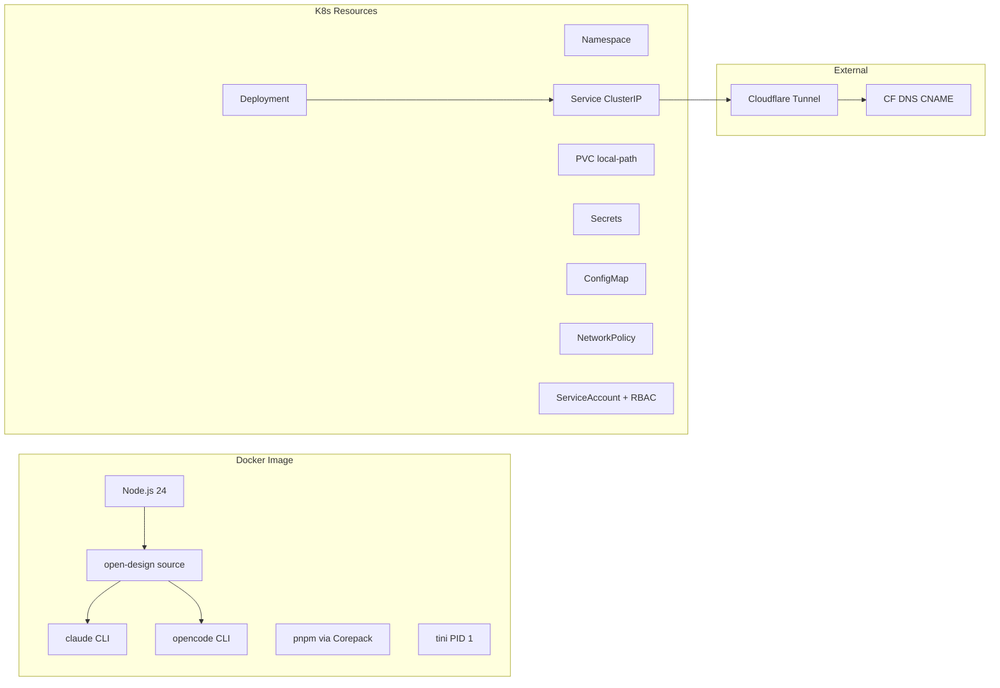

# Woow Open Design - K3s Deployment Package

> **Self-hosted AI Design Platform on Kubernetes** — Deploy [nexu-io/open-design](https://github.com/nexu-io/open-design) on K3s with Claude Code + OpenCode agent CLIs pre-installed, web console, and Cloudflare Tunnel exposure.


---

## Overview

This package provides a production-ready Kubernetes deployment of **Open Design** — the open-source Claude Design alternative. It containerizes the Node.js daemon with all required agent CLIs (Claude Code, OpenCode) pre-installed, adds a web-based terminal console for remote management, and exposes everything through Cloudflare Tunnel for secure public access.

| Challenge | Solution |
|-----------|----------|
| Open Design requires local Node.js + CLI setup | Fully containerized with all dependencies in a single Docker image |
| Agent CLIs need manual installation | Claude Code + OpenCode pre-installed and auto-detected by daemon |
| No remote terminal access to the design pod | Web-based ttyd terminal console with Flask dashboard |
| Exposing to the internet safely | Cloudflare Tunnel integration with HTTPS and edge security |
| CLI auth state lost on pod restart | Persistent `/home` volume (PVC) preserves login sessions |

## Screenshots

### Home Page — Design Prompt Interface


### Agent Detection — Claude Code + OpenCode


### Design Project — Live Slide Preview


### Export Options — PDF, PPTX, Image, ZIP, HTML


### Web Terminal — Remote Pod Access via ttyd


### Console Dashboard — Agent Status API


## Architecture



### Component Overview



## Repository Structure

```
.
├── Dockerfile.open-design          # Multi-stage build: Node 24 + agent CLIs
├── deploy.sh                       # One-click build → import → apply script
├── k8s-manifests/
│   ├── 00-namespace.yaml           # Namespace: open-design
│   ├── 01-secrets.yaml             # OD_API_TOKEN + ANTHROPIC_API_KEY
│   ├── 02-config.yaml              # OD_ALLOWED_ORIGINS, OD_PORT, OD_BIND_HOST
│   ├── 03-pvc.yaml                 # 8Gi data PVC + 2Gi home PVC
│   ├── 04-deployment.yaml          # Daemon deployment (4 CPU / 8Gi RAM)
│   ├── 05-service.yaml             # ClusterIP service on port 7457
│   ├── 06-networkpolicy.yaml       # Ingress rules for daemon + console
│   ├── 07-console-rbac.yaml        # ServiceAccount + Role + RoleBinding
│   ├── 08-console-deployment.yaml  # Console pod (Flask + ttyd) + Service
│   └── 09-console-configmaps.yaml  # Console app code as ConfigMaps
├── console/
│   ├── app.py                      # Flask dashboard with agent status API
│   ├── connect.sh                  # ttyd wrapper: kubectl exec into daemon pod
│   ├── entrypoint.py               # Process orchestrator (Flask + ttyd)
│   └── templates/
│       └── index.html              # Web dashboard UI
├── docs/
│   └── screenshots/                # UI screenshots for documentation
│       ├── od-home.png
│       ├── od-agent-select.png
│       ├── od-project-view.png
│       ├── od-download-menu.png
│       ├── od-tui-login.png
│       └── od-console-dashboard.png
├── .gitignore
├── README.md                       # This file (English)
└── README_zh-TW.md                 # Traditional Chinese README
```

## Prerequisites

| Requirement | Version | Notes |
|-------------|---------|-------|
| K3s | v1.34+ | Single-node or multi-node cluster |
| buildah | 1.33+ | Container image builder (replaces Docker) |
| podman | 4.9+ | Container runtime for verification |
| kubectl | v1.34+ | Kubernetes CLI |
| Cloudflare Account | — | For tunnel and DNS setup |

## Quick Start

### 1. Clone and Deploy

```bash
git clone https://github.com/WOOWTECH/Woow_opendesign_docker_compose_all.git
cd Woow_opendesign_docker_compose_all

# Build image, import to K3s, apply manifests
chmod +x deploy.sh
./deploy.sh
```

### 2. Import Image to K3s

```bash
# Build with buildah
buildah bud -t open-design:latest -f Dockerfile.open-design .

# Import to K3s containerd
podman save open-design:latest | sudo k3s ctr images import -

# Apply all manifests
kubectl apply -f k8s-manifests/
```

### 3. Configure Cloudflare Tunnel

Add these routes to your Cloudflare Tunnel configuration:

| Hostname | Service |
|----------|---------|
| `open-design.your-domain.io` | `http://open-design-svc.open-design.svc.cluster.local:7457` |
| `open-design-tui.your-domain.io` | `http://od-console-svc.open-design.svc.cluster.local:18790` |
| `open-design-term.your-domain.io` | `http://od-console-svc.open-design.svc.cluster.local:7681` |

Create DNS CNAME records pointing each subdomain to `<tunnel-id>.cfargotunnel.com`.

### 4. Authenticate Claude Code

```bash
# Access the web terminal
open https://open-design-term.your-domain.io
# Login: admin / <TUI_PASSWORD from od-secrets>

# Inside the terminal, authenticate Claude:
claude
# Follow the interactive login flow
```

The login state persists across pod restarts thanks to the `open-design-home-pvc`.

## Configuration

### Environment Variables (ConfigMap)

| Variable | Default | Description |
|----------|---------|-------------|
| `OD_PORT` | `7457` | Daemon listen port |
| `OD_BIND_HOST` | `0.0.0.0` | Bind address |
| `OD_ALLOWED_ORIGINS` | `https://open-design.your-domain.io` | CORS allowed origins |
| `OD_DISABLE_API_AUTH` | `1` | Disable token auth (Cloudflare handles security) |

### Secrets

| Key | Description |
|-----|-------------|
| `OD_API_TOKEN` | Auto-generated by deploy.sh (used for internal API calls) |
| `TUI_PASSWORD` | Web terminal login password |
| `ANTHROPIC_API_KEY` | (Optional) Anthropic API key — or use `claude` login instead |

### Resource Limits

| Component | CPU Request | CPU Limit | Memory Request | Memory Limit |
|-----------|-------------|-----------|----------------|--------------|
| Daemon | 1000m | 4000m | 2Gi | 8Gi |
| Console | 100m | 500m | 128Mi | 512Mi |

## Export Formats

All export formats tested and verified:

| Format | Status | Notes |
|--------|--------|-------|
| Export as PDF | Working | Opens in new tab (requires popup permission) |
| Export as PPTX | Working | Editable or screenshot mode |
| Export as Image | Working | PNG, JPEG, WebP formats |
| Download as .zip | Working | Instant download |
| Export as standalone HTML | Working | Single-file HTML |

## Docker Image Details

The multi-stage Dockerfile (`Dockerfile.open-design`) builds:

**Stage 1 (builder):**
- Base: `node:24-slim`
- Clones [nexu-io/open-design](https://github.com/nexu-io/open-design) from source
- Installs dependencies with `corepack pnpm`
- Builds web UI (static export) and daemon

**Stage 2 (runtime):**
- Base: `node:24-slim` (Debian for glibc compatibility)
- Installs `tini` as PID 1 for proper child process management
- Installs **Claude Code** via `npm install -g @anthropic-ai/claude-code`
- Installs **OpenCode** via official installer (`opencode.ai/install`)
- Copies built application from Stage 1
- Final image size: ~3.5 GB

## Security

- **Cloudflare Tunnel** — All traffic encrypted with TLS at edge
- **NetworkPolicy** — Pod-to-pod isolation; only tunnel traffic can reach services
- **RBAC** — Console ServiceAccount scoped to specific pods and deployments
- **No root** — Daemon runs as `opendesign` user (UID 1001)
- **tini** — Proper PID 1 for zombie process reaping

## Troubleshooting

| Symptom | Cause | Fix |
|---------|-------|-----|
| Pod `ErrImageNeverPull` | Image not imported to the correct node | Add `nodeSelector` to pin pod to the node with the image |
| `API_TOKEN_REQUIRED` error | `OD_API_TOKEN` env blocks browser UI | Set `OD_DISABLE_API_AUTH=1` in ConfigMap |
| Claude auth fails: "Invalid API key" | `ANTHROPIC_API_KEY` placeholder overrides login | Remove `ANTHROPIC_API_KEY` from deployment env |
| ttyd returns 502 | NetworkPolicy blocks console ports | Add `od-console-policy` with ports 18790 + 7681 |
| Claude login lost after restart | `/home/opendesign` not persistent | Mount `open-design-home-pvc` at `/home/opendesign` |
| PDF export popup blocked | Browser blocks `window.open()` | Allow popups for the domain in browser settings |

## URLs

| Service | URL | Description |
|---------|-----|-------------|
| Open Design UI | `https://open-design.woowtech.io` | Main design interface |
| Console Dashboard | `https://open-design-tui.woowtech.io` | Flask status dashboard |
| Web Terminal | `https://open-design-term.woowtech.io` | ttyd browser terminal |
| Health Check | `https://open-design.woowtech.io/api/health` | `{"ok":true,"version":"0.12.1"}` |
| Agents API | `https://open-design.woowtech.io/api/agents` | List detected agent CLIs |

## Support

- **Issues:** [GitHub Issues](https://github.com/WOOWTECH/Woow_opendesign_docker_compose_all/issues)
- **Open Design Docs:** [nexu-io/open-design](https://github.com/nexu-io/open-design)
- **OpenCode:** [opencode.ai](https://opencode.ai)
- **Claude Code:** [Anthropic Docs](https://docs.anthropic.com/en/docs/claude-code)

---

*Built and deployed by WOOWTECH on K3s cluster infrastructure.*
