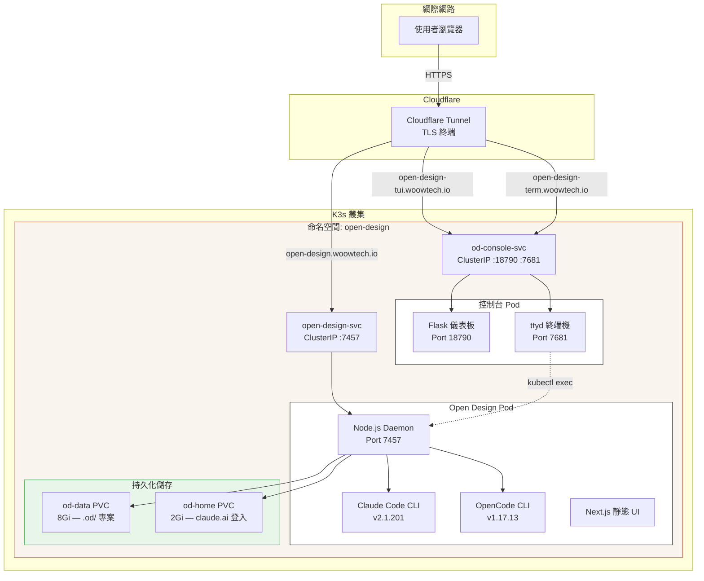

# Woow Open Design — K3s 部署套件

> **自架 AI 設計平台於 Kubernetes** — 將 [nexu-io/open-design](https://github.com/nexu-io/open-design) 部署至 K3s，預裝 Claude Code + OpenCode 代理 CLI，含 Web 終端機控制台，透過 Cloudflare Tunnel 安全對外。


---

## 概述

本套件提供 **Open Design**（開源 Claude Design 替代方案）的生產級 Kubernetes 部署方案。將 Node.js daemon 與所有必要的代理 CLI（Claude Code、OpenCode）打包成單一 Docker 映像檔，加上 Web 終端機控制台進行遠端管理，並透過 Cloudflare Tunnel 提供安全的公開存取。

| 挑戰 | 解決方案 |
|------|----------|
| Open Design 需要本機 Node.js + CLI 設定 | 完全容器化，所有依賴項整合在單一 Docker 映像檔 |
| 代理 CLI 需要手動安裝 | Claude Code + OpenCode 預裝，daemon 自動偵測 |
| 無法遠端存取設計 pod 的終端機 | Web 版 ttyd 終端機控制台 + Flask 儀表板 |
| 安全地對外曝露服務 | Cloudflare Tunnel 整合，HTTPS + 邊緣安全 |
| CLI 認證狀態在 pod 重啟後遺失 | 持久化 `/home` 磁碟區（PVC）保留登入 session |

## 截圖

### 首頁 — 設計提示介面


### 代理偵測 — Claude Code + OpenCode


### 設計專案 — 即時投影片預覽


### 匯出選項 — PDF、PPTX、圖片、ZIP、HTML


### Web 終端機 — 透過 ttyd 遠端存取 Pod


### 控制台儀表板 — 代理狀態 API


## 架構



## 目錄結構

```
.
├── Dockerfile.open-design          # 多階段建置：Node 24 + 代理 CLI
├── deploy.sh                       # 一鍵建置 → 匯入 → 套用腳本
├── k8s-manifests/
│   ├── 00-namespace.yaml           # 命名空間：open-design
│   ├── 01-secrets.yaml             # OD_API_TOKEN + ANTHROPIC_API_KEY
│   ├── 02-config.yaml              # OD_ALLOWED_ORIGINS、OD_PORT、OD_BIND_HOST
│   ├── 03-pvc.yaml                 # 8Gi 資料 PVC + 2Gi home PVC
│   ├── 04-deployment.yaml          # Daemon 部署（4 CPU / 8Gi RAM）
│   ├── 05-service.yaml             # ClusterIP 服務，埠 7457
│   ├── 06-networkpolicy.yaml       # Daemon + 控制台入站規則
│   ├── 07-console-rbac.yaml        # ServiceAccount + Role + RoleBinding
│   ├── 08-console-deployment.yaml  # 控制台 pod（Flask + ttyd）+ Service
│   └── 09-console-configmaps.yaml  # 控制台程式碼（ConfigMap 注入）
├── console/
│   ├── app.py                      # Flask 儀表板 + 代理狀態 API
│   ├── connect.sh                  # ttyd 包裝：kubectl exec 進入 daemon pod
│   ├── entrypoint.py               # 程序協調器（Flask + ttyd）
│   └── templates/
│       └── index.html              # Web 儀表板 UI
├── docs/
│   └── screenshots/                # UI 截圖
├── .gitignore
├── README.md                       # 英文 README
└── README_zh-TW.md                 # 本檔案（繁體中文）
```

## 先決條件

| 需求 | 版本 | 備註 |
|------|------|------|
| K3s | v1.34+ | 單節點或多節點叢集 |
| buildah | 1.33+ | 容器映像檔建置工具（取代 Docker） |
| podman | 4.9+ | 容器執行環境 |
| kubectl | v1.34+ | Kubernetes CLI |
| Cloudflare 帳號 | — | 用於 Tunnel 和 DNS 設定 |

## 快速開始

### 1. 複製並部署

```bash
git clone https://github.com/WOOWTECH/Woow_opendesign_docker_compose_all.git
cd Woow_opendesign_docker_compose_all

# 建置映像、匯入 K3s、套用 manifests
chmod +x deploy.sh
./deploy.sh
```

### 2. 手動建置並匯入

```bash
# 使用 buildah 建置
buildah bud -t open-design:latest -f Dockerfile.open-design .

# 匯入至 K3s containerd
podman save open-design:latest | sudo k3s ctr images import -

# 套用所有 manifests
kubectl apply -f k8s-manifests/
```

### 3. 設定 Cloudflare Tunnel

在你的 Cloudflare Tunnel 設定中新增以下路由：

| 主機名稱 | 服務 |
|----------|------|
| `open-design.your-domain.io` | `http://open-design-svc.open-design.svc.cluster.local:7457` |
| `open-design-tui.your-domain.io` | `http://od-console-svc.open-design.svc.cluster.local:18790` |
| `open-design-term.your-domain.io` | `http://od-console-svc.open-design.svc.cluster.local:7681` |

建立 DNS CNAME 記錄，將每個子網域指向 `<tunnel-id>.cfargotunnel.com`。

### 4. 認證 Claude Code

```bash
# 存取 Web 終端機
open https://open-design-term.your-domain.io
# 登入：admin / <od-secrets 中的 TUI_PASSWORD>

# 在終端機中認證 Claude：
claude
# 依照互動式登入流程完成
```

登入狀態透過 `open-design-home-pvc` 持久化，重啟 pod 不會遺失。

## 設定

### 環境變數（ConfigMap）

| 變數 | 預設值 | 說明 |
|------|--------|------|
| `OD_PORT` | `7457` | Daemon 監聽埠 |
| `OD_BIND_HOST` | `0.0.0.0` | 綁定位址 |
| `OD_ALLOWED_ORIGINS` | `https://open-design.your-domain.io` | CORS 允許來源 |
| `OD_DISABLE_API_AUTH` | `1` | 停用 token 驗證（Cloudflare 負責安全） |

### Secrets

| 金鑰 | 說明 |
|------|------|
| `OD_API_TOKEN` | 由 deploy.sh 自動產生（內部 API 呼叫用） |
| `TUI_PASSWORD` | Web 終端機登入密碼 |
| `ANTHROPIC_API_KEY` | （選用）Anthropic API 金鑰 — 或使用 `claude` 互動式登入 |

### 資源限制

| 元件 | CPU 請求 | CPU 上限 | 記憶體請求 | 記憶體上限 |
|------|----------|----------|------------|------------|
| Daemon | 1000m | 4000m | 2Gi | 8Gi |
| 控制台 | 100m | 500m | 128Mi | 512Mi |

## 匯出格式

所有匯出格式已測試驗證：

| 格式 | 狀態 | 備註 |
|------|------|------|
| 匯出為 PDF | 正常 | 在新分頁開啟（需允許彈出視窗） |
| 匯出為 PPTX | 正常 | 可編輯或截圖模式 |
| 匯出為圖片 | 正常 | PNG、JPEG、WebP 格式 |
| 下載為 .zip | 正常 | 即時下載 |
| 匯出為獨立 HTML | 正常 | 單檔 HTML |

## Docker 映像檔細節

多階段 Dockerfile（`Dockerfile.open-design`）建置內容：

**第一階段（builder）：**
- 基底：`node:24-slim`
- 從原始碼複製 [nexu-io/open-design](https://github.com/nexu-io/open-design)
- 使用 `corepack pnpm` 安裝依賴
- 建置 Web UI（靜態匯出）和 daemon

**第二階段（runtime）：**
- 基底：`node:24-slim`（Debian，glibc 相容性）
- 安裝 `tini` 作為 PID 1，正確管理子程序
- 安裝 **Claude Code**：`npm install -g @anthropic-ai/claude-code`
- 安裝 **OpenCode**：官方安裝程式（`opencode.ai/install`）
- 從第一階段複製建置成果
- 最終映像大小：約 3.5 GB

## 安全性

- **Cloudflare Tunnel** — 所有流量在邊緣以 TLS 加密
- **NetworkPolicy** — Pod 之間隔離；僅 tunnel 流量可存取服務
- **RBAC** — 控制台 ServiceAccount 限定存取特定 pod 和 deployment
- **非 root** — Daemon 以 `opendesign` 使用者執行（UID 1001）
- **tini** — 正確的 PID 1，處理殭屍程序回收

## 疑難排解

| 症狀 | 原因 | 修復 |
|------|------|------|
| Pod `ErrImageNeverPull` | 映像未匯入正確節點 | 加入 `nodeSelector` 固定 pod 到有映像的節點 |
| `API_TOKEN_REQUIRED` 錯誤 | `OD_API_TOKEN` 環境變數擋住瀏覽器 UI | 在 ConfigMap 設定 `OD_DISABLE_API_AUTH=1` |
| Claude 認證失敗：「Invalid API key」 | `ANTHROPIC_API_KEY` placeholder 覆蓋登入 | 從 deployment env 移除 `ANTHROPIC_API_KEY` |
| ttyd 回傳 502 | NetworkPolicy 擋住控制台埠 | 新增 `od-console-policy`，埠 18790 + 7681 |
| Claude 登入在重啟後遺失 | `/home/opendesign` 未持久化 | 掛載 `open-design-home-pvc` 到 `/home/opendesign` |
| PDF 匯出彈出視窗被擋 | 瀏覽器擋住 `window.open()` | 在瀏覽器設定中允許該網域的彈出視窗 |

## 服務網址

| 服務 | 網址 | 說明 |
|------|------|------|
| Open Design UI | `https://open-design.woowtech.io` | 主要設計介面 |
| 控制台儀表板 | `https://open-design-tui.woowtech.io` | Flask 狀態儀表板 |
| Web 終端機 | `https://open-design-term.woowtech.io` | ttyd 瀏覽器終端機 |
| 健康檢查 | `https://open-design.woowtech.io/api/health` | `{"ok":true,"version":"0.12.1"}` |
| 代理 API | `https://open-design.woowtech.io/api/agents` | 列出偵測到的代理 CLI |

## 支援

- **問題回報：** [GitHub Issues](https://github.com/WOOWTECH/Woow_opendesign_docker_compose_all/issues)
- **Open Design 文件：** [nexu-io/open-design](https://github.com/nexu-io/open-design)
- **OpenCode：** [opencode.ai](https://opencode.ai)
- **Claude Code：** [Anthropic 文件](https://docs.anthropic.com/en/docs/claude-code)

---

*由 WOOWTECH 建置並部署於 K3s 叢集基礎設施。*
